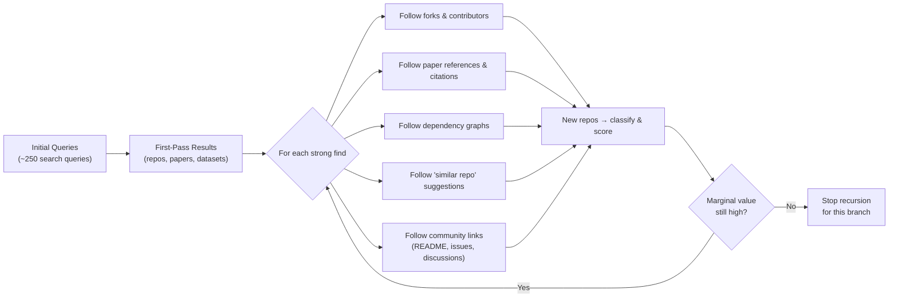

# Algorithmic Crypto Trading — Exhaustive Research Strategy

> [!IMPORTANT]
> **Status**: PLAN ONLY — No searches executed yet. Awaiting user approval to launch.

---

## Architecture Overview

```mermaid
flowchart TD
    subgraph W0["WAVE 0 — Seed Analysis (Sequential)"]
        M01["M01: OpenAlice Seed Analysis"]
    end

    subgraph W1["WAVE 1 — Broad Parallel Discovery (22 missions)"]
        M02["M02: GitHub Code Repos"]
        M03["M03: GitLab/Codeberg/Bitbucket"]
        M04["M04: Academic Papers"]
        M05["M05: HuggingFace Models"]
        M06["M06: Kaggle Datasets"]
        M07["M07: Trading Frameworks"]
        M08["M08: Arbitrage & MEV"]
        M09["M09: RL & Agent Trading"]
        M10["M10: Time-Series & Transformers"]
        M11["M11: Market Making & Microstructure"]
        M12["M12: On-Chain & DeFi"]
        M13["M13: Reddit & Forums"]
        M14["M14: Twitter/X & Blogs"]
        M15["M15: Package Registries"]
        M16["M16: Awesome Lists & Curations"]
        M17["M17: LLM/Agentic Trading"]
        M18["M18: Portfolio & Risk"]
        M19["M19: Data Vendors & Pipelines"]
        M20["M20: Backtesting & Simulation"]
        M21["M21: International Communities"]
        M22["M22: Internet Archive & Dead Projects"]
        M23["M23: Competitions & Verified Track Records"]
    end

    subgraph W2["WAVE 2 — Deep Dives (Depends on W1)"]
        M24["M24: Fork & Lineage Tracing"]
        M25["M25: Negative Evidence & Failure Analysis"]
        M26["M26: Reproducibility Audit"]
        M27["M27: Infrastructure & Deployment Stacks"]
        M28["M28: AutoML & Strategy Discovery"]
    end

    subgraph W3["WAVE 3 — Synthesis (Depends on W2)"]
        M29["M29: Strategy Matrix & Taxonomy"]
        M30["M30: Ranking & Scoring"]
        M31["M31: Gap Analysis & Build Queue"]
        M32["M32: Final Report Assembly"]
    end

    W0 --> W1
    W1 --> W2
    W2 --> W3
```

---

## Wave 0 — Seed Analysis (Sequential, must complete first)

### M01: OpenAlice Seed Analysis
**Objective**: Analyze the reference architecture at `https://github.com/TraderAlice/OpenAlice` — its repo structure, dependencies, strategy design, execution layer, data requirements, model usage, backtesting methodology, risk controls, limitations, forks, stars, issues, and contributors.

**Search Queries**:
1. `site:github.com TraderAlice/OpenAlice`
2. `"OpenAlice" crypto trading`
3. `"TraderAlice" github`
4. `github.com/TraderAlice/OpenAlice forks`
5. `"OpenAlice" site:reddit.com OR site:twitter.com`

**Recursion**: From OpenAlice's dependencies, README links, contributor profiles, and forks → feed discovered repos/people into Wave 1 missions.

---

## Wave 1 — Broad Parallel Discovery (22 missions, all independent)

> [!NOTE]
> All 22 Wave 1 missions can run **fully in parallel** — zero dependencies between them.

---

### M02: GitHub Code Repositories
**Objective**: Exhaustive GitHub search for complete trading systems, crypto bots, AI trading, multi-agent systems.

**Search Queries** (rotate across GitHub search, Google `site:github.com`, and GitHub Topics):
1. `crypto trading bot` (GitHub search, sort by stars, then by recently updated)
2. `algorithmic crypto trading system`
3. `autonomous crypto trading agent`
4. `cryptocurrency trading bot python`
5. `crypto market making bot`
6. `quant strategy github crypto`
7. `profitable trading strategy github`
8. `multi-agent trading system`
9. `AI trading bot crypto`
10. `deep learning crypto trading`
11. `machine learning trading bot`
12. `ccxt trading bot`
13. `crypto trading framework`
14. `trading system architecture github`
15. GitHub Topics: `cryptocurrency-trading`, `trading-bot`, `algorithmic-trading`, `crypto-bot`, `quantitative-finance`

**Pagination**: First 10 pages per query minimum. Follow "Similar repositories" sidebars.

---

### M03: GitLab / Codeberg / Bitbucket / SourceForge
**Objective**: Find projects hosted outside GitHub.

**Search Queries**:
1. `site:gitlab.com crypto trading bot`
2. `site:gitlab.com algorithmic trading`
3. `site:codeberg.org trading bot`
4. `site:codeberg.org crypto`
5. `site:bitbucket.org crypto trading`
6. `site:bitbucket.org algorithmic trading bot`
7. `site:sourceforge.net crypto trading`
8. `site:sourceforge.net trading bot`
9. `site:gitlab.com market making bot`
10. `site:gitlab.com quantitative trading`

---

### M04: Academic Papers (arXiv, SSRN, Google Scholar, Semantic Scholar)
**Objective**: Find research papers on crypto trading strategies, ML for trading, market microstructure.

**Search Queries**:
1. `arXiv: "cryptocurrency trading" reinforcement learning` (2022-2026)
2. `arXiv: "algorithmic trading" transformer deep learning`
3. `arXiv: "market making" cryptocurrency`
4. `arXiv: "order book" prediction deep learning`
5. `arXiv: "crypto" "statistical arbitrage"`
6. `arXiv: "temporal fusion transformer" financial`
7. `arXiv: "PatchTST" OR "Informer" OR "TimeGPT" financial forecasting`
8. `arXiv: "MEV" "maximal extractable value" strategy`
9. `arXiv: "DEX arbitrage" OR "decentralized exchange" trading`
10. `SSRN: cryptocurrency algorithmic trading`
11. `SSRN: crypto market microstructure`
12. `Google Scholar: "crypto trading" "reinforcement learning" 2024-2026`
13. `Google Scholar: "LLM trading agent" OR "large language model trading"`
14. `Semantic Scholar: cryptocurrency trading system machine learning`
15. `Google Scholar: "funding rate arbitrage" cryptocurrency`
16. `arXiv: "graph neural network" financial market`
17. `arXiv: "diffusion model" financial forecasting`
18. `arXiv: "state space model" OR "Mamba" time series finance`

**Recursion**: Every paper's references section → follow cited works. Every paper's "cited by" → follow forward citations.

---

### M05: HuggingFace Models & Datasets
**Objective**: Find pretrained models, fine-tuned checkpoints, datasets for financial/crypto tasks.

**Search Queries**:
1. `site:huggingface.co crypto trading`
2. `site:huggingface.co financial time series`
3. `site:huggingface.co stock prediction`
4. `site:huggingface.co market forecasting`
5. `site:huggingface.co sentiment finance`
6. `site:huggingface.co reinforcement learning trading`
7. HuggingFace search: `crypto`, `trading`, `financial`, `stock`, `market`, `time-series`, `OHLCV`
8. HuggingFace datasets: `cryptocurrency`, `orderbook`, `tick data`, `financial`
9. `site:huggingface.co "foundation model" finance`
10. `site:huggingface.co FinRL OR Qlib`

---

### M06: Kaggle Datasets & Competitions
**Objective**: Find crypto/financial datasets, competition solutions, notebooks.

**Search Queries**:
1. `site:kaggle.com cryptocurrency trading`
2. `site:kaggle.com crypto orderbook`
3. `site:kaggle.com bitcoin prediction`
4. `site:kaggle.com algorithmic trading`
5. `site:kaggle.com "tick data" crypto`
6. `site:kaggle.com OHLCV cryptocurrency`
7. `site:kaggle.com crypto sentiment`
8. `site:kaggle.com "funding rate"`
9. `site:kaggle.com DeFi data`
10. Kaggle competitions: `crypto`, `trading`, `financial`, `time series`

---

### M07: Trading Frameworks Ecosystem
**Objective**: Map the entire landscape of established trading frameworks and their AI/ML extensions.

**Search Queries**:
1. `Freqtrade AI strategy` / `Freqtrade machine learning`
2. `Hummingbot strategy` / `Hummingbot custom strategy`
3. `Jesse AI trading` / `Jesse strategy`
4. `NautilusTrader crypto`
5. `Lean QuantConnect crypto strategy`
6. `Zipline crypto fork` / `Zipline reloaded`
7. `Backtrader crypto strategy machine learning`
8. `Catalyst crypto trading`
9. `VectorBT crypto strategy`
10. `TensorTrade` / `TensorTrade examples`
11. `CCXT bot framework`
12. `Gekko trading bot` (archived but referenced)
13. `OctoBot crypto`
14. `Superalgos trading`
15. `Enigma Catalyst crypto`

**Recursion**: For each framework → find community plugins, strategy repos, forks with ML integrations.

---

### M08: Arbitrage & MEV Systems
**Objective**: Find all arbitrage and MEV-related projects, tools, strategies.

**Search Queries**:
1. `cross exchange arbitrage bot crypto github`
2. `triangular arbitrage cryptocurrency`
3. `DEX arbitrage bot` / `Uniswap arbitrage`
4. `MEV bot github` / `MEV strategy`
5. `flashbots searcher strategy`
6. `sandwich bot` / `frontrunning bot` (for understanding, not deployment)
7. `liquidation bot DeFi`
8. `funding rate arbitrage bot`
9. `basis trading crypto` / `cash and carry crypto`
10. `crypto arbitrage scanner`
11. `Jito MEV solana`
12. `MEV boost ethereum strategy`
13. `atomic arbitrage smart contract`
14. `CEX DEX arbitrage`
15. `latency arbitrage crypto`

---

### M09: Reinforcement Learning & Agent-Based Trading
**Objective**: Find RL trading systems, gym environments, multi-agent simulations.

**Search Queries**:
1. `FinRL` / `FinRL github examples`
2. `reinforcement learning crypto trading github`
3. `gym trading environment crypto`
4. `stable baselines trading`
5. `PPO trading agent`
6. `SAC trading agent crypto`
7. `multi-agent trading simulation`
8. `offline reinforcement learning trading`
9. `world model trading`
10. `imitation learning trading`
11. `deep reinforcement learning portfolio optimization`
12. `RL market making`
13. `model-based RL trading`
14. `reward shaping trading`
15. `meta-reinforcement learning finance`

---

### M10: Time-Series ML & Transformer Models
**Objective**: Find cutting-edge forecasting models applied to financial/crypto data.

**Search Queries**:
1. `Temporal Fusion Transformer crypto` / `TFT financial forecasting`
2. `Informer time series finance` / `Informer crypto prediction`
3. `PatchTST financial` / `PatchTST crypto`
4. `TimeGPT financial` / `TimeGPT crypto`
5. `Mamba time series finance` / `state space model financial`
6. `LSTM crypto trading` / `LSTM bitcoin prediction`
7. `transformer stock prediction` / `transformer crypto trading`
8. `diffusion model financial forecasting`
9. `graph neural network financial market`
10. `temporal CNN financial` / `WaveNet trading`
11. `N-BEATS financial` / `N-HiTS financial`
12. `foundation model time series finance`
13. `Chronos time series finance`
14. `Lag-Llama financial`
15. `iTransformer financial`

---

### M11: Market Making & Microstructure
**Objective**: Find market making bots, orderbook analysis, LOB models.

**Search Queries**:
1. `market making bot crypto github`
2. `orderbook prediction deep learning`
3. `LOB transformer` / `limit order book model`
4. `market microstructure crypto`
5. `Avellaneda Stoikov crypto`
6. `spread trading bot`
7. `liquidity provision strategy`
8. `order flow prediction crypto`
9. `high frequency trading crypto github`
10. `HFT crypto bot`
11. `market making reinforcement learning`
12. `optimal execution algorithm crypto`
13. `LOBSTER data analysis`
14. `queue position model limit order`
15. `bid ask spread model cryptocurrency`

---

### M12: On-Chain, DeFi & DEX Strategies
**Objective**: Find on-chain alpha, wallet tracking, DeFi strategy tools.

**Search Queries**:
1. `on-chain alpha crypto github`
2. `wallet tracking bot` / `whale detection crypto`
3. `copy trading bot crypto`
4. `DeFi yield strategy bot`
5. `DEX aggregator strategy`
6. `stablecoin flow analysis`
7. `exchange flow analysis` / `CEX inflow outflow`
8. `on-chain data analysis crypto github`
9. `Dune Analytics trading strategy`
10. `Nansen alternative open source`
11. `smart money tracking crypto`
12. `DeFi liquidation strategy`
13. `LP strategy optimization`
14. `Uniswap v3 strategy`
15. `MEV protection strategy`

---

### M13: Reddit, Forums & Community Discovery
**Objective**: Find community discussions, strategy threads, tool recommendations.

**Search Queries**:
1. `site:reddit.com/r/algotrading crypto bot`
2. `site:reddit.com/r/CryptoCurrency algorithmic trading`
3. `site:reddit.com/r/quant crypto strategy`
4. `site:reddit.com/r/Bitcoin trading bot`
5. `site:reddit.com/r/ethfinance MEV`
6. `site:reddit.com/r/reinforcementlearning trading`
7. `site:reddit.com/r/MachineLearning trading`
8. `site:quant.stackexchange.com crypto algorithmic trading`
9. `site:stackoverflow.com ccxt trading bot`
10. `site:reddit.com "best crypto trading bot" open source`
11. `site:reddit.com/r/algotrading "backtesting framework"`
12. `site:reddit.com/r/CryptoMarkets bot strategy`
13. `quantitative trading forum crypto`
14. `elite trader forum crypto algorithmic`
15. `Wilmott forum crypto trading`

---

### M14: Twitter/X, Blogs & Newsletter Discovery
**Objective**: Find quant traders, researchers, engineering blogs sharing strategies.

**Search Queries**:
1. `site:medium.com algorithmic crypto trading`
2. `site:medium.com machine learning trading bot`
3. `site:substack.com crypto trading strategy`
4. `site:substack.com quantitative crypto`
5. `crypto hedge fund engineering blog`
6. `trading firm engineering blog crypto`
7. `"quant trading" blog crypto strategy`
8. `site:blog.*.com algorithmic trading crypto`
9. Twitter/X search: `crypto trading bot open source`
10. Twitter/X search: `algorithmic trading crypto github`
11. Twitter/X search: `FinRL crypto`
12. `site:towardsdatascience.com crypto trading`
13. `site:neptune.ai trading`
14. `site:wandb.ai trading`
15. `quantitative crypto newsletter`

---

### M15: Package Registries (PyPI, NPM, Crates, Go, Julia)
**Objective**: Find trading libraries and tools in package ecosystems.

**Search Queries**:
1. `site:pypi.org crypto trading`
2. `site:pypi.org algorithmic trading`
3. `site:pypi.org ccxt`
4. `site:pypi.org backtest`
5. `site:npmjs.com crypto trading`
6. `site:npmjs.com trading bot`
7. `site:crates.io trading` / `site:crates.io crypto`
8. `site:pkg.go.dev trading` / `site:pkg.go.dev crypto`
9. `site:juliahub.com trading` / `site:juliahub.com finance`
10. `site:hub.docker.com crypto trading bot`
11. `site:hub.docker.com trading`
12. `PyPI: ta-lib, pandas-ta, finta, tulipy` (feature engineering)
13. `PyPI: vectorbt, backtesting.py, bt`
14. `Rust high frequency trading crypto`

---

### M16: Awesome Lists & Curated Collections
**Objective**: Find meta-lists that aggregate trading resources.

**Search Queries**:
1. `awesome algorithmic trading github`
2. `awesome crypto trading github`
3. `awesome quant github`
4. `awesome quantitative finance github`
5. `awesome trading bot github`
6. `awesome DeFi github`
7. `awesome MEV github`
8. `awesome machine learning trading github`
9. `awesome reinforcement learning finance github`
10. `awesome time series github`
11. `awesome financial datasets github`
12. `curated list crypto trading bots`
13. `awesome ccxt`
14. `awesome market making`

**Recursion**: Every link in every awesome list → classify and feed into relevant mission.

---

### M17: LLM & Agentic Trading Systems
**Objective**: Find LLM-powered trading agents, tool-using agents, autonomous trading.

**Search Queries**:
1. `LLM trading agent github`
2. `GPT trading bot crypto`
3. `large language model trading strategy`
4. `autonomous trading agent LLM`
5. `tool-using trading agent`
6. `multi-agent market simulation LLM`
7. `ChatGPT crypto trading`
8. `Claude trading agent`
9. `FinGPT trading`
10. `LLM sentiment trading crypto`
11. `agentic trading system`
12. `AI agent crypto portfolio`
13. `LangChain trading` / `AutoGPT trading`
14. `foundation model finance trading`
15. `LLM alpha generation`

---

### M18: Portfolio Optimization & Risk Management
**Objective**: Find portfolio allocation, sizing, risk management tools.

**Search Queries**:
1. `portfolio optimization crypto github`
2. `Kelly criterion trading github`
3. `risk parity crypto`
4. `dynamic position sizing`
5. `Bayesian optimization trading`
6. `factor model crypto`
7. `risk management trading bot`
8. `portfolio allocation machine learning`
9. `Markowitz optimization crypto`
10. `Black-Litterman crypto`
11. `CVaR optimization trading`
12. `drawdown control strategy`
13. `volatility targeting crypto`
14. `correlation regime crypto portfolio`
15. `hierarchical risk parity crypto`

---

### M19: Data Vendors, Pipelines & Alternative Data
**Objective**: Find free/paid data sources, data pipeline tools, alternative data.

**Search Queries**:
1. `free crypto tick data download`
2. `crypto orderbook data free`
3. `Level 2 Level 3 crypto data`
4. `historical OHLCV crypto free dataset`
5. `on-chain data free API`
6. `funding rate data historical`
7. `open interest data crypto`
8. `liquidation data crypto feed`
9. `crypto sentiment dataset`
10. `glassnode alternative free`
11. `cryptoquant alternative open source`
12. `Fear Greed index API`
13. `crypto news dataset NLP`
14. `DEX swap data historical`
15. `exchange flow data free`
16. `stablecoin flow data`
17. `crypto options data free`
18. `economic calendar API trading`
19. `Google Trends crypto trading signal`
20. `alternative data crypto trading`

---

### M20: Backtesting & Simulation Environments
**Objective**: Find backtesting engines, market simulators, synthetic data generators.

**Search Queries**:
1. `backtesting framework crypto python`
2. `event-driven backtesting engine`
3. `walk-forward optimization crypto`
4. `market simulator orderbook`
5. `synthetic market data generator`
6. `agent-based market simulation`
7. `realistic backtest slippage model`
8. `crypto backtest framework comparison`
9. `paper trading framework crypto`
10. `vectorbt alternatives`
11. `backtest crypto strategy with fees`
12. `monte carlo simulation trading`
13. `exchange simulator limit order book`
14. `Qlib framework`
15. `ABIDES market simulator`

---

### M21: International Communities (Non-English)
**Objective**: Search Chinese, Russian, Korean, Japanese, Indian, European quant communities.

**Search Queries**:
1. `加密货币 量化交易 机器人 github` (Chinese: crypto quant trading bot)
2. `数字货币 交易策略 开源` (Chinese: digital currency trading strategy open source)
3. `量化交易 深度学习` (Chinese: quantitative trading deep learning)
4. `site:cnblogs.com 加密货币 交易`
5. `site:csdn.net 量化交易 策略`
6. `site:zhihu.com 加密货币 量化`
7. `криптовалюта торговый бот github` (Russian: crypto trading bot)
8. `алгоритмическая торговля криптовалютой` (Russian: algorithmic crypto trading)
9. `암호화폐 트레이딩 봇` (Korean: crypto trading bot)
10. `仮想通貨 自動取引 bot` (Japanese: crypto auto trading bot)
11. `crypto trading bot India github`
12. `site:v2ex.com 量化交易`
13. `site:habr.com криптовалюта торговля`
14. `European quantitative finance crypto`
15. `crypto quant community Europe`

---

### M22: Internet Archive & Dead/Archived Projects
**Objective**: Recover useful code/strategies from discontinued projects.

**Search Queries**:
1. `site:web.archive.org crypto trading`
2. `Quantopian crypto strategy` (archived platform)
3. `Gekko trading bot strategies` (archived)
4. `Catalyst enigma crypto` (archived)
5. `defunct crypto trading bot github`
6. `archived trading strategy repository`
7. `"no longer maintained" crypto trading bot`
8. `github archived crypto trading`
9. `removed crypto trading repository`
10. `deprecated algorithmic trading framework`

---

### M23: Competitions & Verified Track Records
**Objective**: Find trading competitions, public performance reports, verified results.

**Search Queries**:
1. `crypto trading competition results`
2. `algorithmic trading competition`
3. `Numerai crypto`
4. `trading bot competition leaderboard`
5. `verified trading track record crypto`
6. `public trading journal crypto`
7. `transparent strategy performance crypto`
8. `myfxbook crypto` / `trading performance verification`
9. `Kaggle financial prediction competition`
10. `quantitative trading challenge`

---

## Wave 2 — Deep Dives (Depends on Wave 1 results)

> [!WARNING]
> Wave 2 missions require Wave 1 findings as input. Each mission below takes the **aggregated discovery list** from Wave 1 and performs targeted deep analysis.

---

### M24: Fork & Lineage Tracing
**Objective**: For every top-50 repo found in Wave 1, trace forks, contributors, related projects.

**Method**:
- GitHub API: list forks, sort by ahead-commits
- Contributor profiles → their other repos
- Dependency graphs → shared libraries
- "Used by" / "Dependents" on GitHub
- Star overlap analysis (users who starred X also starred Y)

**Search Queries** (templated, filled from W1):
1. `github.com/{repo}/network/members` (fork network)
2. `github.com/{user}?tab=repositories` (contributor repos)
3. `"{repo_name}" fork improved`
4. `"{repo_name}" alternative`

---

### M25: Negative Evidence & Failure Analysis
**Objective**: Find blown accounts, overfitting reports, fake backtests, strategies that stopped working.

**Search Queries**:
1. `crypto trading bot scam` / `crypto bot fake results`
2. `overfitting backtest crypto`
3. `trading bot lost money`
4. `"look ahead bias" crypto backtest`
5. `"data leakage" trading model`
6. `"survivorship bias" crypto trading`
7. `unrealistic backtest crypto`
8. `"stopped working" trading strategy crypto`
9. `crypto bot blown account`
10. `fee blindness trading backtest`
11. `martingale grid trading risk`
12. `crypto trading bot review honest`
13. `"{top_repo_name}" issues problems`
14. `"{top_repo_name}" doesn't work`
15. `site:reddit.com crypto bot "lost money"`

---

### M26: Reproducibility Audit
**Objective**: For top-20 candidates from Wave 1, inspect actual code for completeness.

**Method** (per repo):
- Clone and inspect directory structure
- Check: Does it actually run? Dependencies installable?
- Check: Real strategy logic vs stub/placeholder?
- Check: Backtest reproducible with provided data?
- Check: Paper trading mode available?
- Check: Live trading has kill switch?
- Check: Exchange APIs actually integrated?
- Check: Linux compatible?

**Search Queries**:
1. `"{repo_name}" installation guide`
2. `"{repo_name}" tutorial`
3. `"{repo_name}" issues "doesn't work" OR "error" OR "bug"`
4. `"{repo_name}" docker`

---

### M27: Infrastructure & Deployment Stacks
**Objective**: Find complete deployment architectures (data ingestion → execution → monitoring).

**Search Queries**:
1. `crypto trading infrastructure architecture github`
2. `trading system deployment kubernetes`
3. `trading bot docker compose`
4. `real-time crypto data pipeline`
5. `trading system monitoring grafana`
6. `crypto trading system architecture diagram`
7. `low latency trading infrastructure`
8. `trading bot CI/CD pipeline`
9. `crypto trading logging framework`
10. `model retraining pipeline trading`

---

### M28: AutoML & Automated Strategy Discovery
**Objective**: Find genetic algorithms, symbolic regression, NAS for strategy generation.

**Search Queries**:
1. `genetic algorithm trading strategy github`
2. `evolutionary strategy trading`
3. `symbolic regression trading`
4. `genetic programming crypto`
5. `neural architecture search trading`
6. `AutoML trading strategy`
7. `automated alpha discovery`
8. `alpha factory trading`
9. `feature store trading`
10. `automated strategy generation`
11. `DEAP trading` / `PyGAD trading`
12. `gplearn financial`

---

## Wave 3 — Synthesis (Depends on Wave 2)

> [!TIP]
> Wave 3 is analytical — no new web searches. These missions consume all data from Waves 0-2 and produce the final deliverables.

---

### M29: Strategy Matrix & Taxonomy
**Objective**: Classify every discovery into the 16-category strategy matrix.

**Categories**:
1. Arbitrage
2. Market Making
3. Momentum/Trend
4. Mean Reversion
5. Statistical Arbitrage
6. Funding/Basis
7. Volatility/Options
8. Orderbook/Microstructure
9. On-Chain/DEX/MEV
10. Liquidation/Event-Driven
11. ML Prediction
12. Reinforcement Learning
13. LLM/Agentic
14. Portfolio Allocation
15. Hybrid/Multi-Strategy
16. Automated Strategy Discovery

---

### M30: Ranking & Scoring
**Objective**: Score and rank everything using the evidence classification system.

**Evidence Grades**:
- **A** = Independently verified live results
- **B** = Credible out-of-sample/backtest evidence
- **C** = Plausible research, insufficient validation
- **D** = Weak/self-reported results
- **E** = Marketing/hype/unverifiable

**Scoring Dimensions** (per repo): Reproducibility, Maintenance, Documentation, Community, Stars, Citations, Performance Evidence, Real-World Usage, Risk Management, Code Quality, Architecture, Test Coverage, Live Trading Support, Paper Trading, License, Last Update.

---

### M31: Gap Analysis & Build Queue
**Objective**: Identify what's missing in the ecosystem and prioritize what to build/reimplement.

**Output**: Prioritized build queue ranked by: expected research value × reproducibility × data availability × capital efficiency ÷ risk.

---

### M32: Final Report Assembly
**Objective**: Compile all findings into the 13-section deliverable format (A through M).

---

## Parallelism Map

| Wave | Missions | Parallelism | Est. Subagents |
|------|----------|-------------|----------------|
| W0 | M01 | Sequential (1 mission) | 1 |
| W1 | M02–M23 | **All 22 fully parallel** | 22 |
| W2 | M24–M28 | **All 5 fully parallel** (but need W1 data) | 5 |
| W3 | M29–M32 | Semi-sequential (M29→M30→M31→M32) | 1-2 |

**Total missions**: 32
**Max concurrent subagents**: 22 (Wave 1)
**Practical recommendation**: Batch Wave 1 into 8-10 subagents, each handling 2-3 missions, to stay within resource limits.

---

## Recommended Subagent Batching (Practical)

| Subagent | Missions Assigned | Role |
|----------|------------------|------|
| **SA-01** | M01 | OpenAlice Seed Analyzer |
| **SA-02** | M02, M03 | Code Repository Hunter |
| **SA-03** | M04 | Academic Paper Researcher |
| **SA-04** | M05, M06 | ML Hub & Dataset Scout |
| **SA-05** | M07, M20 | Framework & Backtest Mapper |
| **SA-06** | M08, M12 | DeFi/Arbitrage/MEV Hunter |
| **SA-07** | M09, M10 | RL & Time-Series ML Researcher |
| **SA-08** | M11, M18 | Microstructure & Portfolio Analyst |
| **SA-09** | M13, M14 | Social & Community Intelligence |
| **SA-10** | M15, M16, M22 | Registry, Lists & Archive Digger |
| **SA-11** | M17, M28 | LLM/Agent & AutoML Researcher |
| **SA-12** | M19 | Data Pipeline & Vendor Scout |
| **SA-13** | M21 | International Community Scanner |
| **SA-14** | M23 | Competition & Track Record Verifier |

---

## Recursion Plan

**Recursion Rules**:
1. Every discovered repo with >50 stars → trace forks, contributors, dependents
2. Every paper with >10 citations → follow "cited by" list
3. Every awesome list → follow every link
4. Every researcher/contributor with >2 relevant repos → scan all their repos
5. Stop when 3 consecutive recursion hops yield <2 new relevant finds
6. Maximum recursion depth: 4 hops from any seed

---

## Total Query Count Summary

| Mission | Queries |
|---------|---------|
| M01 | 5 |
| M02 | 15 |
| M03 | 10 |
| M04 | 18 |
| M05 | 10 |
| M06 | 10 |
| M07 | 15 |
| M08 | 15 |
| M09 | 15 |
| M10 | 15 |
| M11 | 15 |
| M12 | 15 |
| M13 | 15 |
| M14 | 15 |
| M15 | 14 |
| M16 | 14 |
| M17 | 15 |
| M18 | 15 |
| M19 | 20 |
| M20 | 15 |
| M21 | 15 |
| M22 | 10 |
| M23 | 10 |
| M24 | 4 (templated) |
| M25 | 15 |
| M26 | 4 (templated) |
| M27 | 10 |
| M28 | 12 |
| **Total** | **~370 base queries** |
| **+ Recursion** | **~500-800 estimated** |

---

> [!CAUTION]
> **Awaiting approval to execute.** Say `go` or `launch` to begin Wave 0 → Wave 1 parallel execution. No searches have been performed yet.
